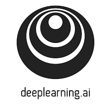

<h1 align="center"> Deep Learning Specialisation by Coursera, deeplearning.ai </h1>

  
  <h3>
      <a href="https://www.coursera.org/specializations/deep-learning">Course Available Here</a>
  </h3>

## What is this?

My source code for the deep learning course offered by Professor Andrew Ng. Concretely, I have implemented the following:

### Course 1: Neural Networks and Deep Learning

**Week 2:** Learnt Numpy basics. Implemented Logistic Regression with a Neural Network mindset.

**Week 3** Implemented planar data classfication with one hidden layer (including forward and backprop) using Numpy.

**Week 4:** Built a *deep neural network* for image classification.

### Course 2: Hyperparameter tuning, Regularisation, and Optimisation

**Week 1:** Implemented *initialization* and *regularisation techniques*, *gradient checking* using Numpy.

**Week 2:** Implemented *mini-batch, momentum gradient descent and Adam* using Numpy.

**Week 3:** Learnt *Tensorflow*.

### Course 4: Convolutional Neural Networks

**Week 1:** Build a *ConvNet* in *TensorFlow* for a classfication problem

**Week 2:** Build a ConvNet using *ResNets* with *Keras*.

**Week 3:** Build *object detection (car) system* using *YOLO model*.

**Week 4:** Build a *face recognition system.* Implemented *neural style transfer* algorithm on art.

### Course 5:

**Week 1:** Built a *RNN*. Improvise a Jazz solo with a *LSTM Network*.

**Week 2:** Built an Emojifier (appends emoji to an input sentence based on its meaning) using *word vectors.*

**Week 3:** Built a Neural Machine Translation using *attention model*. Built *Trigger Word Detection model.*

Separately, you can view my course notes [here,](https://larrylawl.github.io/notes/coursera-dl-notes.html) and my course certificates in the links below.

1. [Course 1: Neural Networks and Deep Learning](https://www.coursera.org/account/accomplishments/certificate/CWFWGPQKMHWL)
2. [Course 2: Improving Deep Neural Networks: Hyperparameter tuning, Regularization and Optimization](https://www.coursera.org/account/accomplishments/certificate/9EBTFVA4VHBW)
3. [Course 4: Convolutional Neural Networks](https://www.coursera.org/account/accomplishments/certificate/MMXN4JZTXSBP)
4. [Course 5: Sequence Models](https://www.coursera.org/account/accomplishments/certificate/EBTT8MMCTD6C)

## Credits
Much gratitude to Professor Andrew Ng, and his team at deeplearning.ai, for providing making AI accessible for all. 